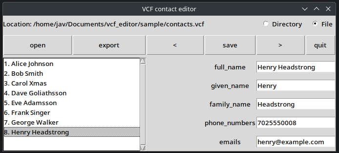

# VCF Editor

Python GUI for VCF (contact files) with **Tkinter** and **Streamlit** interfaces.

## Features

- Reading single VCF file or directory with VCF files
- Exporting contacts to a directory
- Editing and saving contact data
- Two GUI options: classic Tkinter or modern Streamlit

## Project Structure

```
vcf_editor/
├── Contact.py        # Core contact management (shared library)
├── main.py           # Launcher script
├── gui_tkinter.py    # Tkinter GUI implementation
├── gui_streamlit.py  # Streamlit GUI implementation
├── requirements.in   # Direct dependencies (edit this)
├── requirements.txt  # Locked dependencies (auto-generated)
├── sample/           # Sample VCF files
├── docs/             # Documentation
│   ├── ARCHITECTURE.md  # Common logic & design
│   └── RESOURCES.md     # External references
└── README.md
```

## Setup

Prepare environment:

```shell
python -m venv venv
source ./venv/bin/activate  # linux/macos
venv/Scripts/activate       # windows
pip install -r requirements.txt
```

## Dependency Management

This project uses [pip-tools](https://pip-tools.readthedocs.io/) to manage dependencies.

- `requirements.in` — direct dependencies (edit this file)
- `requirements.txt` — locked dependencies with versions (auto-generated)

### Adding or updating dependencies

```shell
# Install pip-tools (if not already installed)
pip install pip-tools

# Edit requirements.in, then regenerate requirements.txt
pip-compile requirements.in

# Install/update packages
pip install -r requirements.txt
```

## Running the Application

### Option 1: Main Launcher

```shell
# Tkinter (default)
python main.py

# Tkinter explicitly
python main.py --tk

# Streamlit
python main.py --st
```

### Option 2: Run Interfaces Directly

```shell
# Tkinter interface
python gui_tkinter.py

# Streamlit interface
streamlit run gui_streamlit.py
```

## Screenshots

### Tkinter Interface


### Streamlit Interface
The Streamlit interface provides a modern web-based UI matching the Tkinter layout:
- Same button row: open, export, <, save, >, quit
- Contact list on the left
- Edit form on the right
- File upload or local path input

## UI Behavior

Both interfaces follow the same interaction pattern:

1. **Mode Selection**: Choose between Directory or File mode
2. **Open Dialog**: 
   - Tkinter: Native OS file/folder picker opens automatically on mode switch
   - Streamlit: File uploader expands automatically on mode switch
3. **Navigation**: Use < > buttons or click contacts in the list
4. **Edit & Save**: Modify fields and click save
5. **Export**: Download as VCF or export to local folder

See [docs/ARCHITECTURE.md](docs/ARCHITECTURE.md) for detailed logic description.

## To Do

- Loading contact cards with special character sets (tested only utf-8 + win1250)
- Phones sanitization
- Form fields sanitization
- Duplicate detection improvements

## Resources

See [docs/RESOURCES.md](docs/RESOURCES.md) for VCF references and encoding guides.
